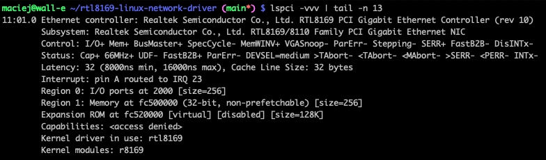

# Realtek RTL8169 Ethernet Driver for Linux
This repository contains my implementation of Linux driver for RTL8169SC Ethernet controller.  
Overview:
* Uses PCI
* DMA support
* MMIO based
* Works in Gigabit Ethernet mode 
* Tested on x86-64 machine

`lspci` output:

 
The RTL8169 network card:

## Using the driver
The following steps show how to build and use the driver on target system:
* Unload the driver provided by the kernel: `sudo rmmod r8169`
* Run `make` in the cloned repository to build the kernel module
* Load the module: `sudo insmod rtl8169.ko`

Required packages: `linux-headers`, `build-essential`